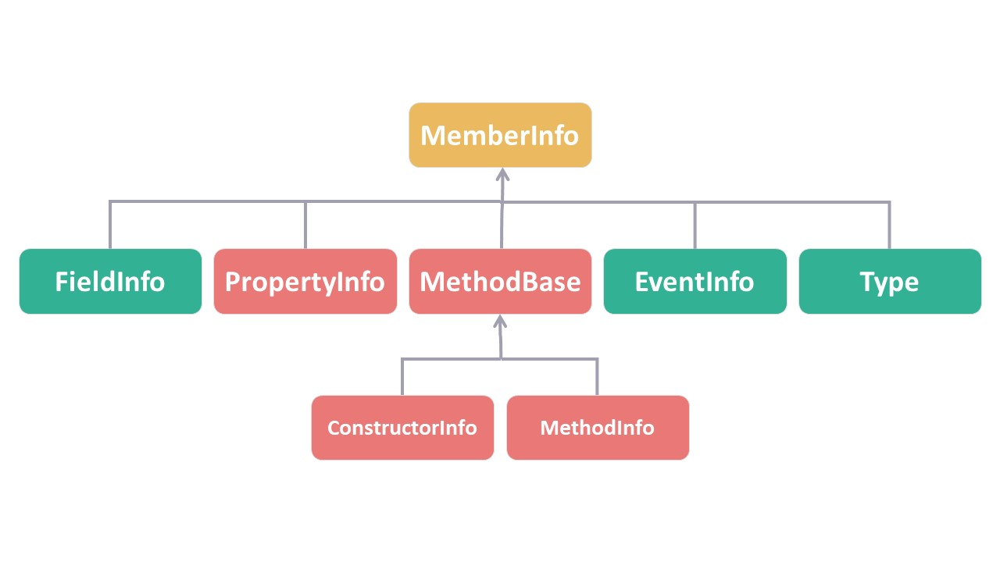
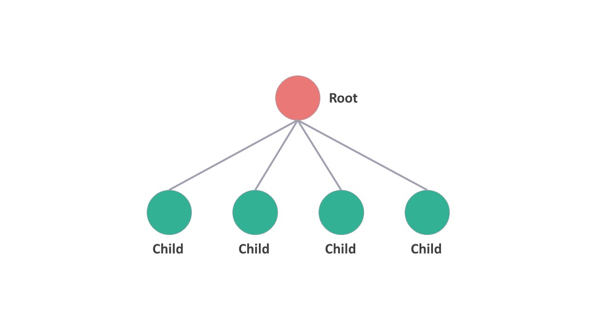

# Tiny Dependency Injection

项目是为了配合[💉什么是依赖注入](https://github.com/dingtingli/study/blob/main/Dependency/Dependency%20Injection.md)这篇文章而创建的。如果希望了解依赖注入的原理，可以跳转到文章中了解详情。

## 技术准备——反射机制

正常情况下，程序的执行是先实例化然后再调用方法，常见的实例化方式是使用关键字 `new`，比如下面的代码：

```c#
A a = new A();
```

应用程序中的 `Class A` 是晚于依赖注入框架代码的，所以不可能在框架中直接使用 `new A()`。现在的问题就可以转变成：**有没有办法可以替代 `new` 来实例化一个对象？**

`Class` 作为一个类型，在面向对象的语言中（比如 C#）是可以访问其元数据的。`typeof` 方法能够获取类型的构造函数、方法、字段、属性和事件等信息。

```C#
Type a = typeof(A);
//or
Type a = Type.GetType("A");
```
<figure>
    
</figure>

有了类型的元数据，面向对象语言提供的反射机制就能够实例化出相应的对象。具体操作是，向 `Activator.CreateInstance` 方法中传入 `Type` 类型（以及构造函数所需的参数列表），就可以返回实例化对象。

```C#
Type a = typeof(A);
object test = Activator.CreateInstance(a);
```

## TinyDependencyInjection01

掌握了反射的知识以后，我们就可以开始尝试编写一个简易的控制反转框架，并应用到准备好的测试代码中:

```c#
//Test Services
class A
{
    private IB _b;

    public A(IB b)
    {
        _b = b;
    }

    public void MethodA()
    {
        Console.WriteLine("Class A -> Method A / before call Method B");
        _b.MethodB();
    }
}

interface IB
{
    void MethodB();
}

class B : IB
{
    public void MethodB()
    {
        Console.WriteLine("Class B -> Method B");
    }
}
```

应用程序首先需要告知框架，接口和类是对应关系，这个过程通常称为“注册”。比如代码中，接口 `IB` 跟 `Class B` 就是对应的关系，我们需要提前将这个关系注册到框架中。

为了在框架中保存多个对应关系，框架可以将其保存到字典数据结构（Dictionary）中。

字典中的 Key-Value，可以分别存放`IB` 的 `Type`（Key）和 `Class B` 的 `Type`（Value）。

同时，我们提供两个方法 `AddRegister` 和 `GetRegister` 用于注册新的信息和获取已注册信息。

```c#
public class DependencyRegister
{
    private ConcurrentDictionary<Type, Type> _registers;

    public DependencyRegister()
    {
        _registers = new ConcurrentDictionary<Type, Type>();
    }

    public void AddRegister(Type TFrom, Type TTo)
    {
        _registers.TryAdd(TFrom, TTo);
    }

    public Type? GetRegister(Type TFrom)
    {
        if(_registers.TryGetValue(TFrom, out var toType))
        {
            return toType;
        }

        return null;
    }
}
```

此时 `Main` 函数中的注册信息可以写成这样。

```C#
var register = new DependencyRegister();
register.AddRegister(typeof(A),typeof(A));
register.AddRegister(typeof(IB),typeof(B));
```

这里我们不仅仅注册了 `IB` 和 `Class B` 的关系，同时还把 `Class A` 也注册了，这是为了告诉框架，`Class A` 也需要通过框架来实例化。

上面 `Main` 函数中的写法有些过于麻烦，我们可以使用泛型来进行简化。

``` C#
var register = new DependencyRegister();
register.AddRegister<A>();
register.AddRegister<IB,B>();
```

为了适配这种写法，需要在 `DependencyRegister` 中另外添加了几个 `AddRegister` 方法。

```c#
public void AddRegister<TFrom, TTo>()
{
    AddRegister(typeof(TFrom), typeof(TTo));
}
public void AddRegister<TFrom>()
{
    AddRegister(typeof(TFrom), typeof(TFrom));
}

```

最终，`DependencyRegister` 的代码就像下面这样：

```c#
public class DependencyRegister
{
    private ConcurrentDictionary<Type, Type> _registers;

    public DependencyRegister()
    {
        _registers = new ConcurrentDictionary<Type, Type>();
    }

    public void AddRegister<TFrom, TTo>()
    {
        AddRegister(typeof(TFrom), typeof(TTo));
    }

    public void AddRegister<TFrom>()
    {
        AddRegister(typeof(TFrom), typeof(TFrom));
    }

    public void AddRegister(Type TFrom, Type TTo)
    {
        _registers.TryAdd(TFrom, TTo);
    }

    public Type? GetRegister(Type TFrom)
    {
        if(_registers.TryGetValue(TFrom, out var toType))
        {
            return toType;
        }

        return null;
    }
}
```

信息已经注册完毕，接下来就看看如何结合反射机制来使用这些信息。

框架中有了注册的 `Type` 信息，我们就可以使用反射机制将这些信息实例化出来。

从应用程序角度看，就像是从一个“容器”中获取相应的实例。在 `Main` 函数中，可以写成这样：

```c#
var register = new DependencyRegister();
register.AddRegister<A>();
register.AddRegister<IB, B>();

var container = new DependencyContainer(register);
var a = container.GetService<A>();

a.MethodA();
```

我们添加一个 `DependencyContainer` 类来实现上面的功能。首先该类要接收所有的注册信息。

```C#
public class DependencyContainer
{
    DependencyRegister _container;

    public DependencyContainer(DependencyRegister container)
    {
        _container = container;
    }
}
```

其次，需要根据提供的 `Key` 值，找到注册信息中的 `Value`，并将其实例化。

``` c#
public class DependencyContainer
{
    DependencyRegister _container;

    public DependencyContainer(DependencyRegister register)
    {
        _container = register;
    } 
    
    public T GetService<T>()
    {
        var type = _container.GetRegister(typeof(T));
        return (T)Activator.CreateInstance(type);
    }
}
```

就像上面这段代码展示的一样，`GetService` 可以通过反射机制将当前的 `Value` 实例化。调用这个方法，下面这段代码中的变量 `a` 将会获得一个实例化的 `Class A` 对象。

```c#
var a = container.GetService<A>();
//a.MethodA(); //error
```

然而，在调用 `a.MethodA()` 时会报错，因为方法 `MethodA` 中需要调用 `_b.MethodB();`。此时，虽然 `IB` 和 `Class B` 的关系已经被注册，但是还没有被实例化。

## TinyDependencyInjection02

我们需要修改 `GetService` 方法，让所有他需要的注册过的接口都能被实例化。

重新改写一下 `GetService`，其中最重要的两个方法是获取构造函数的方法 `GetConstructors`，和获取方法中参数的 `GetParameters` 方法。

```c#
public T GetService<T>()
{
    var dependency = _container.GetRegister(typeof(T));

    var constructor = dependency.GetConstructors().Single();
    var parameters = constructor.GetParameters().ToArray();

    if (parameters.Length > 0)
    {
        var parameterImplementations = new List<object>();

        foreach (var parameter in parameters)
        {
            var parameterDependency = _container.GetRegister(parameterParameterType);
            var parameterImplementation = Activator.CreateInstanc(parameterDependency);
            parameterImplementations.Add(parameterImplementation);
        }

        return (T)Activator.CreateInstance(dependency,parameterImplementations.ToArray());
    }

    return (T)Activator.CreateInstance(dependency);
}
```

在获取了构造函数中所有的参数之后，我们需要依次将其实例化。方式也和之前一样，首先是从注册信息中找到对应的 `Type` 信息，然后通过反射机制，将其实例化。

把所以实例化好的参数，放入一个 List `parameterImplementations` 中，最终通过反射来将其传入构造函数，来实例化最终类型。

此时下面的 `Main` 函数就可以正常运行了。

```c#
var register = new DependencyRegister();
register.AddRegister<A>();
register.AddRegister<IB, B>();

var container = new DependencyContainer(register);
var a = container.GetService<A>();

a.MethodA();
```

## TinyDependencyInjection03

上面这段 `GetService` 的实现虽然可以满足我们的示例代码，但还有些问题。

我们修改一下测试代码，添加一个接口 `IC` 和 `Class C`，并且让 `Class B` 依赖于 `IC`。

```C#
//Test Services
class A
{
    private IB _b;

    public A(IB b)
    {
        _b = b;
    }

    public void MethodA()
    {
        Console.WriteLine("Class A -> Method A / before call Method B");
        _b.MethodB();
    }
}

interface IB
{
    void MethodB();
}

class B : IB
{
    private IC _c;

    public B(IC c)
    {
        _c = c;
    }
    public void MethodB()
    {
        Console.WriteLine("Class B -> Method B / before call Method C");
        _c.MethodC();
    }
}

interface IC
{
    void MethodC();
}

class C : IC
{
    public void MethodC()
    {
        Console.WriteLine("Class C -> Method C");
    }
}
```

大家可能已经看到问题了，这是因为方法中 `GetService`，构成函数中的参数虽然已经被实例化了，但是参数的构造函数可能也有参数……一直这么循环，这时候你可能会想到用递归来解决。

所以我们修改一下代码，用递归的方式来重写 `GetService` 方法。

```c#
public T GetService<T>()
{
    return (T)GetService(typeof(T));       
}
public object GetService(Type type)
{
    var dependency = _container.GetRegister(type);

    var constructor = dependency.GetConstructors().Single();
    var parameters = constructor.GetParameters().ToArray();

    if (parameters.Length > 0)
    {
        var parameterImplementations = new List<object>();

        foreach (var parameter in parameters)
        {
            //递归 recursion
            var parameterImplementation = GetService(parameterParameterType);
            parameterImplementations.Add(parameterImplementation);
        }
        return Activator.CreateInstance(dependency,parameterImplementations.ToArray());
    }
    return Activator.CreateInstance(dependency);
}
```

问题完美解决，我们可以先休息一下，接下去我们在框架中添加“生命周期”这个概念。

## TinyDependencyInjection04

在框架的作用下，应用程序所有的类都可以由框架来实例化。框架就像造物主，创造了一切。那么造物主是否可以管理这些它亲手创造出来的对象呢？

打个比方，`Class A` 在构造函数注入时，实例化了一个 `Class C` 的对象，如果接下来 `Class B` 在构造函数注入时也需要一个 `Class C` 的实例化对象，这时候是重新 new 一个对象，还是使用之前在 `Class A` 中已经 new 好的对象？

这就是控制反转框架中生命周期这个概念要讨论的内容。

如果每次注入后，都创建一个新的对象，我们称之为 `Transient` (瞬态)。如果多次注入，都共享同一个对象，我们称之为 `Singleton`(单例)。

这样框架实例化的对象就有了两个生命周期：`Transient` (瞬态) 和 `Singleton`(单例)。

为了能够更好地说明框架中生命周期是如何实现的，我们首先修改一下测试代码。

```c#
//Test Services
class A
{
    private IB _b;

    public A(IB b)
    {
        _b = b;
    }

    public void MethodA()
    {
        Console.WriteLine("Class A -> Method A / before call Method B");
        _b.MethodB();
    }
}

interface IB
{
    void MethodB();
}

class B : IB
{
    private IC _c;

    public B(IC c)
    {
        _c = c;
    }
    public void MethodB()
    {
        Console.WriteLine("Class B -> Method B / before call Method C");
        _c.MethodC();
    }
}

interface IC
{
    void MethodC();
}

class C : IC
{
    int _random;

    public C()
    {
        _random = new Random().Next();
    }

    public void MethodC()
    {
        Console.WriteLine($"{_random} Class C -> Method C");
    }
}
```

在 `Class C` 中，我们添加了一个随机数 `_random`，并将其输出。这样就可以通过这个随机数来确认，框架实例化的 `Class C` 的对象是不是同一个。

接下来，我们就将在框架中实现这两个生命周期。

首先使用枚举，来定义这两个生命周期在框架中的名字。

```c#
public enum DependencyLifetimeType
{
    Singleton,
    Transient,
}
```

接下来修改注册类 `DependencyRegister`，之前我们保存注册信息使用的是字典，字典中的 Key-Value，可以分别存放`IB` 的 `Type`（Key）和 `Class B` 的 `Type`（Value）。现在有了生命周期，我们需要将生命周期的信息也加入到 `Value` 中。

因此，我们创建了一个新类 `DependencyType`，在这个类中，不仅有原先的 `Type`，也加入了新的生命周期信息`DependencyLifetimeType`。

```c#
public class DependencyType
{
    public Type ServiceType { get; set; }

    public DependencyLifetimeType Lifetime { get; set; }

    public DependencyType(Type TTo, DependencyLifetimeType lifetime)
    {
        ServiceType = TTo;
        Lifetime = lifetime;
    }
}
```

所以现在的注册信息保持在下面这个字典中，`Key` 不变， `Value` 变成了刚刚定义的 `DependencyType`。

```c#
private ConcurrentDictionary<Type, DependencyType> _registers;
```

另外，为了保存 `Singleton`(单例)的对象，我们还定义了一个字典，专门用于保存已经实例化过的对象。

```c#
private ConcurrentDictionary<Type, object?> _services;
```

对应的这两个数据结构，我们还为其定义添加 item 和查询 item 的方法。分别是 `AddRegister`、`GetRegister`、`GetService`、`SetService`。

```c#
public class DependencyRegister
{
    private ConcurrentDictionary<Type, DependencyType> _registers;

    private ConcurrentDictionary<Type, object?> _services;

    public DependencyRegister()
    {
        _registers = new ConcurrentDictionary<Type, DependencyType>();
        _services = new ConcurrentDictionary<Type, object>();
    }

    public void AddRegister(Type TFrom, DependencyType TTo)
    {
        _registers.TryAdd(TFrom, TTo);
    }

    public DependencyType? GetRegister(Type TFrom)
    {
        if (_registers.TryGetValue(TFrom, out var toType))
        {
            return toType;
        }

        return null;
    }

    public object? GetService(Type TFrom)
    {
        if (_services.TryGetValue(TFrom, out var toObject))
        {
            return toObject;
        }

        return null;
    }

    public void SetService(Type type, object value)
    {
        _services.TryAdd(type, value);
    }
}
```

之前我们是通过这种方式来注册关系的 `register.AddRegister<IB, B>()`，现在注册的时候需要知道生命周期，可以使用下面的方式来注册。

```c#
register.AddTransient<IB, B>();
register.AddTransient<IC, C>();
```

为了配合这种方式，可以直接修改 `DependencyRegister` 中的注册方法。

```C#
public void AddTransient<TFrom, TTo>()
{
    var dependencyType = new DependencyType(typeof(TTo), DependencyLifetimeType.Transient);
    AddRegister(typeof(TFrom), dependencyType);
}

public void AddSingleton<TFrom, TTo>()
{
    var dependencyType = new DependencyType(typeof(TTo), DependencyLifetimeType.Singleton);
    AddRegister(typeof(TFrom), dependencyType);
}
```

现在，注册部分的代码已经修改完毕。我们再来看看 `DependencyContainer` 部分的代码如何修改。

在使用反射机制实例化对象之前，我需要判断生命周期信息，如果是 `Singleton`(单例)就先尝试从字典中查找；如果是 `Transient` (瞬态)那么操作方式跟之前一样。

实例化对象之后，如果是 `Singleton`(单例)，我们还需要将其保存到字典中。

根据这个需求，将 `DependencyContainer` 中的 `GetService` 方法修改如下：

```C#
public object GetService(Type type)
{
    var dependency = _container.GetRegister(type);

    switch (dependency.Lifetime)
    {
        case DependencyLifetimeType.Transient:
            break;
        case DependencyLifetimeType.Singleton:
            var SingletonObject = _container.GetService(type);
            if (SingletonObject == null)
            {
                break;
            }
            else
            {
                return SingletonObject;
            }
        default: break;
    }

    var constructor = dependency.ServiceType.GetConstructors().Single();
    var parameters = constructor.GetParameters().ToArray();

    var parameterImplementations = new List<object>();

    if (parameters.Length > 0)
    {
        foreach (var parameter in parameters)
        {
            var parameterImplementation = GetService(parameter.ParameterType);
            parameterImplementations.Add(parameterImplementation);
        }
    }

    object result = null;
    result = Activator.CreateInstance(dependency.ServiceType, parameterImplementations.ToArray());

    switch (dependency.Lifetime)
    {
        case DependencyLifetimeType.Transient:
            break;
        case DependencyLifetimeType.Singleton:
            _container.SetService(type, result);
            break;
        default: break;
    }

    return result;
}
```

框架代码修改完毕，我们来试试之前的测试代码，将 `Class C` 注册成 `Singleton`(单例)。

```c#
var register = new DependencyRegister();
register.AddTransient<A>();
register.AddTransient<IB, B>();
register.AddSingleton<IC, C>();
//register.AddTransient<IC, C>();

var container = new DependencyContainer(register);
var c = container.GetService<IC>();
var b = container.GetService<IB>();
var a = container.GetService<A>();

c.MethodC();
b.MethodB();
a.MethodA();
```

从输出结果来看，随机数一直没有变化，说明框架中 `Class C` 的实例对象只有一个，这符合我们对`Singleton`(单例)生命周期的定义。

```cmd
1230177043 Class C -> Method C
Class B -> Method B / before call Method C
1230177043 Class C -> Method C
Class A -> Method A / before call Method B
Class B -> Method B / before call Method C
1230177043 Class C -> Method C
```

大功告成，现在我们在自己的框架中给实例化的对象赋予了两种生命周期 `Singleton`(单例) 和 `Transient` (瞬态)。

## TinyDependencyInjection05

接下来，我来聊聊另外一种生命周期 `Scoped`(范围)。

在 ASP.NET CORE 中，`Scoped`(范围)是指期指同一个客户端请求时，每次返回同一个服务对象；不同的客户端请求时，每次返回不同的服务对象。

这和生命周期 `Singleton`(单例) 略有不同，`Scoped`(范围)不是每次都返回相同的对象，它是在给定的范围内返回相同的对象，在不同的范围内返回不同的对象。

那么范围这个概念如何通过代码实现？

我们回顾一下之前的注册类 `DependencyRegister`，通过一个字典保存了已经实例化的对象，从而实现了 `Singleton`(单例) 生命周期。

```c#
public class DependencyRegister
{
    private ConcurrentDictionary<Type, DependencyType> _registers;

    private ConcurrentDictionary<Type, object?> _services;

    public DependencyRegister()
    {
        _registers = new ConcurrentDictionary<Type, DependencyType>();
        _services = new ConcurrentDictionary<Type, object>();
    }

    //...
}    
```

如果每个`Scoped`(范围)都实例化一个注册类 `DependencyRegister`，那不是就满足满足需求了嘛？

那么同时满足 `Singleton`(单例) 和 `Singleton`(单例)，可以先实例化一个`DependencyRegister` 叫 `root`，然后每个 `Scoped`(范围)都实例化一个`DependencyRegister`，将这些实例化的对象与 `root` 形成父子关系。

<figure>
    
</figure>

`root` 中保持注册信息，和 `Singleton`(单例) 的对象；子类中保存 `Singleton`(单例)的对象，并且可以访问 `root` 中的信息。

这种父子关系，可以使用下面这种方式实现：
```c#
public class Foo
{
    public Foo Parent { get; set; }
}

var parent = new Foo();
var child = new Foo() { Parent = parent };
```

有了以上的这些概念，就可以对 `DependencyRegister` 类进行修改：

```c#
public class DependencyRegister
{
    internal readonly DependencyRegister _root;
    private ConcurrentDictionary<Type, DependencyType> _registers;
    private ConcurrentDictionary<Type, object?> _services;

    public DependencyRegister()
    {        
        _registers = new ConcurrentDictionary<Type, DependencyType>();
        _root = this;
        _services = new ConcurrentDictionary<Type, object>();
    }

    internal DependencyRegister(DependencyRegister parent)
    {
        _root = parent._root;
        _registers = _root._registers;
        _services = new ConcurrentDictionary<Type, object>();
    }

    public DependencyRegister CreateScope(DependencyRegister register)
    {
        return new(register);
    }

    //...
}    
```

为了方便管理`Singleton`(单例) 和 `Scoped`(范围) 中的对象，我们添加对应的方法：`GetSiglentonService`、`SetSiglentonService`、`GetScopedService`、`SetScopedService`。

```C#
public class DependencyRegister
{
    //...

    public object? GetSiglentonService(Type TFrom)
    {
        if (_root._services.TryGetValue(TFrom, out var toObject))
        {
            return toObject;
        }

        return null;
    }

    public void SetSiglentonService(Type type, object value)
    {
        _root._services.TryAdd(type, value);
    }

    public object? GetScopedService(Type TFrom)
    {
        if (_services.TryGetValue(TFrom, out var toObject))
        {
            return toObject;
        }

        return null;
    }

    public void SetScopedService(Type type, object value)
    {
        _services.TryAdd(type, value);
    }

    //...
}
```

整体的数据结果都已经确定，接下来只需要在容器中添加相应的处理就可以。最终将 `DependencyContainer` 类中 `GetService` 方法做一些调整，添加了 `Scoped`(范围)相关的内容。

```c#
public object GetService(Type type)
{
    var dependency = _container.GetRegister(type);

    switch (dependency.Lifetime)
    {
        case DependencyLifetimeType.Transient:
            break;
        case DependencyLifetimeType.Singleton:
            var SingletonObject = _container.GetSiglentonService(type);
            if (SingletonObject == null)
            {
                break;
            }
            else
            {
                return SingletonObject;
            }
        case DependencyLifetimeType.Scoped:
            var ScopedObject = _container.GetScopedService(type);
            if (ScopedObject == null)
            {
                break;
            }
            else
            {
                return ScopedObject;
            }
        default: break;
    }

    //...

    switch (dependency.Lifetime)
    {
        case DependencyLifetimeType.Transient:
            break;
        case DependencyLifetimeType.Singleton:
            _container.SetSiglentonService(type, result);
            break;
        case DependencyLifetimeType.Scoped:
            _container.SetScopedService(type, result);
            break;
        default: break;
    }
    return result;
}
```

我们继续使用之前的测试代码来验证 `Scoped`(范围)功能。

```c#
var register = new DependencyRegister();
register.AddTransient<A>();
register.AddTransient<IB, B>();
register.AddScoped<IC, C>();

var register1 = register.CreateScope(register);
var register2 = register.CreateScope(register);

var container1 = new DependencyContainer(register1);
var c1 = container1.GetService<IC>();
var b1 = container1.GetService<IB>();
var a1 = container1.GetService<A>();

c1.MethodC();
b1.MethodB();
a1.MethodA();

Console.WriteLine("==========");

var container2 = new DependencyContainer(register2);
var c2 = container2.GetService<IC>();
var b2 = container2.GetService<IB>();
var a2 = container2.GetService<A>();

c2.MethodC();
b2.MethodB();
a2.MethodA();
```

将 `Class C` 注册成 `Scoped`(范围)，最终的结果如下，同一个`Scoped`(范围)随机数一样，不同的 `Scoped`(范围) 随机数不同。

```cmd
799939690 Class C -> Method C
Class B -> Method B / before call Method C
799939690 Class C -> Method C
Class A -> Method A / before call Method B
Class B -> Method B / before call Method C
799939690 Class C -> Method C
==========
194815900 Class C -> Method C
Class B -> Method B / before call Method C
194815900 Class C -> Method C
Class A -> Method A / before call Method B
Class B -> Method B / before call Method C
194815900 Class C -> Method C
```

到这里，我们这个简易的控制反转框架就算完成了基本的功能。

**更多内容可以关注我的公众号：dingtingli-pub**

<figure>
    
</figure>